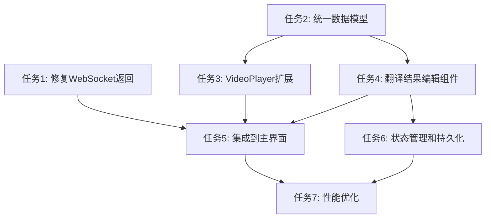

# 字幕编辑器需求分析与实现方案

> **更新说明**：本文档已基于 mcp-shrimp-task-manager 五大模式规划和联网技术调研进行全面更新，包含详细的任务分解和架构分析。

## 需求概述

用户希望在视频字幕翻译完成后，能够：

1. **查看翻译结果**：显示翻译前后的字幕内容和对应时间轴范围
2. **编辑翻译内容**：可以直接修改翻译后的每一行字幕
3. **实时预览**：在视频播放器中拖动进度条时，能看到修改后的字幕直接渲染在视频上
4. **同步播放**：字幕与视频时间轴同步显示

## 项目架构分析（基于五大模式调研）

### 🏗️ 现有架构优势

**前端架构**：
- **技术栈**：Electron + React + TypeScript + Material-UI
- **状态管理**：Redux Toolkit + Redux Persist
- **工作区结构**：pnpm workspace，前后端分离
- **组件设计**：函数式组件 + Hooks，使用 memo 优化性能

**后端架构**：
- **技术栈**：Python FastAPI + Pydantic + WebSocket
- **模块化设计**：api/core/services/schemas 清晰分层
- **依赖管理**：UV 包管理器，支持多种 AI 服务集成

### ✅ 已有功能（详细分析）

1. **视频播放器组件** (`VideoPlayer.tsx`)
   - ✅ 完整的播放控制（播放/暂停/进度/音量/全屏）
   - ✅ 时间更新回调 `onTimeUpdate` 和节流优化
   - ✅ 字幕显示开关 `showSubtitles` 接口（但无实际渲染）
   - ✅ Material-UI 设计风格，响应式布局
   - ✅ 性能优化：throttle、memo、事件防抖

2. **字幕编辑器组件** (`SubtitleEditor.tsx`)
   - ✅ 字幕列表显示和虚拟滚动优化
   - ✅ 单行字幕编辑（时间和文本）
   - ✅ 编辑对话框界面和验证逻辑
   - ✅ 已定义 SubtitleItem 接口
   - ✅ 支持翻译功能集成

3. **翻译功能**
   - ✅ 完整的视频字幕翻译流程
   - ✅ WebSocket 实时进度监控
   - ✅ 多 AI 提供商支持（OpenAI、Claude、DeepSeek 等）
   - ✅ 翻译配置和模型选择
   - ✅ 任务状态管理和错误处理

### ❌ 关键缺失功能（基于架构分析）

1. **翻译结果返回机制**（最高优先级）
   - 🔍 **根本原因**：`backend/api/routers/translate_v2.py:281` 硬编码 `results: []`
   - ❌ 后端翻译完成时，WebSocket 只发送空的 `results: []`
   - ❌ 没有将实际翻译结果通过 WebSocket 返回给前端
   - 📊 **影响范围**：阻塞所有后续功能

2. **字幕数据结构不统一**（高优先级）
   - 🔍 **数据模型冲突**：
     - 后端：`SubtitleLine` (start_time: str, text: str)
     - 前端：`SubtitleItem` (startTime: number, text: string)
     - 共享：`SubtitleTrack` (缺少时间和文本字段)
   - ❌ 前后端数据交换格式不一致
   - ❌ 时间格式处理分散（SRT vs 秒数）

3. **视频字幕渲染引擎**（中优先级）
   - ❌ VideoPlayer 有 `showSubtitles` 接口但无渲染逻辑
   - ❌ 缺少字幕覆盖层组件
   - ❌ 缺少字幕与视频时间精确同步机制
   - ❌ 缺少字幕样式配置支持

4. **翻译结果编辑界面**（中优先级）
   - ❌ 缺少专门的翻译结果编辑组件
   - ❌ 没有原文译文对照显示
   - ❌ 缺少与视频播放器的双向时间同步
   - ❌ 缺少编辑状态管理和持久化

## 详细问题分析

### 问题1：翻译结果为空

**现状**：
```typescript
// 前端接收到的 WebSocket 消息
{
  "type": "completed",
  "message": "翻译完成",
  "results": []  // ❌ 始终为空
}
```

**原因**：
- 后端 `translate_v2.py` 中的回调函数硬编码了 `results: []`
- 翻译完成时没有将实际的翻译结果传递给 WebSocket

### 问题2：数据结构不匹配

**前端期望格式**：
```typescript
interface TranslationResult {
  startTime: number;    // 开始时间（秒）
  endTime: number;      // 结束时间（秒）
  original: string;     // 原文
  translated: string;   // 译文
  confidence?: number;  // 可信度
}
```

**后端生成格式**：
```python
class SubtitleLine(BaseModel):
    index: int
    start_time: str      # 时间格式：HH:MM:SS,mmm
    end_time: str        # 时间格式：HH:MM:SS,mmm
    text: str            # 原文
    translated_text: str # 译文
```

### 问题3：视频字幕渲染缺失

**现状**：
- `VideoPlayer.tsx` 有 `showSubtitles` 属性但没有实际渲染逻辑
- 缺少字幕轨道数据传入
- 没有时间同步机制

## 基于 mcp-shrimp-task-manager 的实现方案

> **重要更新**：以下方案已通过 mcp-shrimp-task-manager 进行详细任务分解，包含 7 个具体任务和完整的依赖关系图。

### 🎯 任务分解概览

基于五大模式（RESEARCH → INNOVATE → PLAN → EXECUTE → REVIEW）的分析，已创建以下 7 个任务：

1. **修复翻译结果WebSocket返回机制** (ID: c31145f4-9ace-4631-a0d0-5b4acf4d1514)
2. **创建统一的字幕数据模型** (ID: bb969117-7a4f-4ee4-839a-5f362f19bfdf)
3. **扩展VideoPlayer组件字幕渲染功能** (ID: 61d5ad4c-3529-42f0-874c-2282b628f5a6)
4. **创建翻译结果编辑组件** (ID: 5b16c4f8-1f6f-455e-ae3e-22b1c64d5cb9)
5. **集成翻译结果到主界面** (ID: 2ce4e33f-1c2b-49b5-ba64-dfc29e2f6359)
6. **实现编辑状态管理和持久化** (ID: 5016dc9b-c468-4ae2-af9c-247e4af42248)
7. **性能优化和用户体验增强** (ID: 6ae171ad-8bfc-40b9-bc66-796350a3c84a)

### 🔧 任务1：修复翻译结果返回机制（最高优先级）

**问题定位**：`backend/api/routers/translate_v2.py:281` 硬编码 `results: []`

**解决方案**：
```python
# 添加 SRT 解析函数
def parse_srt_content(srt_content: str) -> List[Dict]:
    """解析SRT内容为前端格式"""
    import re
    results = []
    pattern = r'(\d+)\n(\d{2}:\d{2}:\d{2},\d{3}) --> (\d{2}:\d{2}:\d{2},\d{3})\n(.*?)(?=\n\d+\n|\n*$)'
    matches = re.findall(pattern, srt_content, re.DOTALL)

    for match in matches:
        index, start_time, end_time, text = match
        results.append({
            "index": int(index),
            "startTime": srt_time_to_seconds(start_time),
            "endTime": srt_time_to_seconds(end_time),
            "startTimeStr": start_time,
            "endTimeStr": end_time,
            "original": text.strip(),
            "translated": text.strip(),
        })
    return results

# 修改回调函数
async def callback(progress: float, status: str, message: str):
    if status == "completed":
        translation_results = []
        try:
            # 从翻译任务中获取结果
            temp_result_file = os.path.join(temp_dir, f"{task_id}_result.srt")
            if os.path.exists(temp_result_file):
                with open(temp_result_file, 'r', encoding='utf-8') as f:
                    srt_content = f.read()
                    translation_results = parse_srt_content(srt_content)
        except Exception as e:
            logger.error(f"获取翻译结果失败: {e}")

        websocket_message = {
            "type": "completed",
            "message": message,
            "results": translation_results,  # ✅ 实际翻译结果
        }
```

### 🔧 任务2：创建统一的字幕数据模型

**架构兼容性分析**：
- ✅ 复用现有 `frontend/shared` 工作区结构
- ✅ 保持与现有 `SubtitleItem` 接口的向后兼容
- ✅ 遵循项目的 TypeScript 严格类型检查

**实现方案**：
```typescript
// frontend/shared/src/types/subtitle.ts
export interface UnifiedSubtitleItem {
  id: string;
  index: number;
  startTime: number;        // 秒数（JavaScript 标准）
  endTime: number;          // 秒数（JavaScript 标准）
  startTimeStr: string;     // SRT格式 "HH:MM:SS,mmm"
  endTimeStr: string;       // SRT格式 "HH:MM:SS,mmm"
  originalText: string;
  translatedText?: string;
  confidence?: number;
  edited?: boolean;         // 编辑状态标记
}

export interface TranslationResult extends UnifiedSubtitleItem {
  translatedText: string;   // 必须有译文
}

export interface SubtitleStyle {
  fontSize?: string;
  color?: string;
  backgroundColor?: string;
  fontFamily?: string;
  textShadow?: string;
  position?: 'bottom' | 'top' | 'center';
}

// frontend/electron-app/src/utils/timeUtils.ts
export const timeUtils = {
  srtToSeconds: (timeStr: string): number => {
    const [time, ms] = timeStr.split(',');
    const [hours, minutes, seconds] = time.split(':').map(Number);
    return hours * 3600 + minutes * 60 + seconds + (Number(ms) || 0) / 1000;
  },

  secondsToSrt: (seconds: number): string => {
    const hours = Math.floor(seconds / 3600);
    const minutes = Math.floor((seconds % 3600) / 60);
    const secs = Math.floor(seconds % 60);
    const ms = Math.floor((seconds % 1) * 1000);

    return `${hours.toString().padStart(2, '0')}:${minutes.toString().padStart(2, '0')}:${secs.toString().padStart(2, '0')},${ms.toString().padStart(3, '0')}`;
  },

  formatDisplayTime: (seconds: number): string => {
    const minutes = Math.floor(seconds / 60);
    const secs = Math.floor(seconds % 60);
    return `${minutes.toString().padStart(2, '0')}:${secs.toString().padStart(2, '0')}`;
  }
};
```

### 方案3：实现视频字幕渲染（优先级：中）

#### 3.1 扩展 VideoPlayer 组件

**文件**：`frontend/electron-app/src/components/VideoPlayer.tsx`

**新增属性**：
```typescript
interface VideoPlayerProps {
  // ... 现有属性
  subtitles?: SubtitleItem[];           // 字幕数据
  currentSubtitles?: SubtitleItem[];    // 当前时间的字幕
  showSubtitles?: boolean;              // 是否显示字幕
  subtitleStyle?: SubtitleStyle;        // 字幕样式
}
```

**新增字幕渲染逻辑**：
```typescript
// 根据当前时间筛选字幕
const getCurrentSubtitles = (time: number, subtitles: SubtitleItem[]) => {
  return subtitles.filter(sub => 
    time >= sub.startTime && time <= sub.endTime
  );
};

// 字幕渲染组件
const SubtitleOverlay = ({ subtitles, style }) => (
  <Box sx={{
    position: 'absolute',
    bottom: 60,
    left: '50%',
    transform: 'translateX(-50%)',
    color: 'white',
    textAlign: 'center',
    textShadow: '2px 2px 4px rgba(0,0,0,0.8)',
    fontSize: '1.2rem',
    maxWidth: '80%',
    ...style
  }}>
    {subtitles.map(sub => (
      <Typography key={sub.id}>
        {sub.translatedText || sub.originalText}
      </Typography>
    ))}
  </Box>
);
```

### 方案4：创建翻译结果编辑界面（优先级：中）

#### 4.1 新建翻译结果编辑组件

**新文件**：`frontend/electron-app/src/components/TranslationResultEditor.tsx`

**功能特性**：
- 左右分栏显示原文和译文
- 支持逐行编辑译文
- 实时保存修改
- 与视频播放器同步

```typescript
interface TranslationResultEditorProps {
  results: TranslationResult[];
  onResultChange: (index: number, newText: string) => void;
  currentTime?: number;  // 当前播放时间
  onTimeJump?: (time: number) => void;  // 跳转到指定时间
}
```

#### 4.2 集成到主界面

**修改文件**：`frontend/electron-app/src/pages/VideoDetailWithTranslation.tsx`

**布局调整**：
```typescript
// 翻译完成后的界面布局
<Grid container spacing={2}>
  <Grid item xs={12} md={8}>
    <VideoPlayer 
      src={video.filePath}
      subtitles={editedResults}  // 使用编辑后的结果
      showSubtitles={true}
      onTimeUpdate={setCurrentTime}
    />
  </Grid>
  <Grid item xs={12} md={4}>
    <TranslationResultEditor
      results={translationResults}
      onResultChange={handleResultChange}
      currentTime={currentTime}
      onTimeJump={handleTimeJump}
    />
  </Grid>
</Grid>
```

### 方案5：数据持久化（优先级：低）

#### 5.1 本地存储编辑结果

```typescript
// 自动保存编辑结果到本地存储
const saveEditedResults = (videoId: string, results: TranslationResult[]) => {
  localStorage.setItem(`edited_subtitles_${videoId}`, JSON.stringify(results));
};

// 加载编辑结果
const loadEditedResults = (videoId: string): TranslationResult[] | null => {
  const saved = localStorage.getItem(`edited_subtitles_${videoId}`);
  return saved ? JSON.parse(saved) : null;
};
```

#### 5.2 导出功能

```typescript
// 导出为SRT文件
const exportToSRT = (results: TranslationResult[], filename: string) => {
  const srtContent = results.map((item, index) => 
    `${index + 1}\n${item.startTimeStr} --> ${item.endTimeStr}\n${item.translatedText}\n`
  ).join('\n');
  
  // 触发下载
  const blob = new Blob([srtContent], { type: 'text/plain' });
  const url = URL.createObjectURL(blob);
  // ... 下载逻辑
};
```

## 基于 mcp-shrimp-task-manager 的执行计划

### 📊 任务依赖关系图



### 🎯 实施优先级（基于依赖分析）

**第一阶段（并行开发）**：
- 🔥 **任务1**：修复翻译结果返回机制（阻塞性，最高优先级）
- 🔥 **任务2**：创建统一的字幕数据模型（基础设施，高优先级）

**第二阶段（核心功能）**：
- ⚡ **任务3**：扩展VideoPlayer组件字幕渲染功能
- ⚡ **任务4**：创建翻译结果编辑组件

**第三阶段（集成）**：
- 🎯 **任务5**：集成翻译结果到主界面

**第四阶段（增强）**：
- 🚀 **任务6**：实现编辑状态管理和持久化
- 🚀 **任务7**：性能优化和用户体验增强

## 技术难点与解决方案（基于联网调研）

### 🔍 技术调研结果

通过对字幕编辑器和视频同步技术的调研，发现以下关键技术点：

1. **时间格式转换**
   - **难点**：SRT格式 (`HH:MM:SS,mmm`) 与 JavaScript 时间戳的精确转换
   - **解决方案**：使用正则表达式解析，注意 SRT 使用逗号分隔毫秒
   - **最佳实践**：创建双向转换工具，支持边界情况处理

2. **实时同步**
   - **难点**：视频播放时间与字幕显示的精确同步
   - **解决方案**：使用 `timeupdate` 事件 + throttle 优化
   - **最佳实践**：考虑视频解码延迟，添加时间偏移配置

3. **性能优化**
   - **难点**：大量字幕数据的渲染性能
   - **解决方案**：虚拟滚动 + React.memo + 时间窗口过滤
   - **最佳实践**：只渲染当前时间窗口附近的字幕

4. **状态管理**
   - **难点**：编辑状态的管理和持久化
   - **解决方案**：Redux + localStorage + 防抖保存
   - **最佳实践**：使用 Immer 处理不可变状态更新

### 🛠️ 技术实现策略

**WebSocket 实时通信**：
- 复用现有的 WebSocket 管理器
- 确保消息格式与前端期望一致
- 添加连接重试和错误恢复机制

**视频字幕渲染**：
- 使用 CSS 绝对定位实现字幕覆盖层
- 支持多行字幕和样式自定义
- 考虑不同视频分辨率的适配

**编辑器组件设计**：
- 左右分栏布局，原文译文对照
- 支持键盘导航和快捷键
- 实现撤销重做功能栈

## 具体实现步骤

### 步骤1：修复翻译结果返回（立即执行）

#### 1.1 修改后端翻译完成回调

**文件**：`backend/api/routers/translate_v2.py`

```python
# 在翻译任务完成后，需要获取翻译结果
async def get_translation_results_from_task(task_id: str, translator: SubtitleTranslator) -> List[Dict]:
    """从翻译任务中获取结果并转换为前端格式"""
    try:
        # 获取任务信息
        task = translator.get_task(task_id)
        if not task or task.status != "completed":
            return []

        # 读取翻译结果文件
        if task.result_path and os.path.exists(task.result_path):
            # 解析SRT文件
            subtitle_lines = parse_srt_file(task.result_path)

            # 转换为前端格式
            results = []
            for line in subtitle_lines:
                results.append({
                    "startTime": srt_time_to_seconds(line.start_time),
                    "endTime": srt_time_to_seconds(line.end_time),
                    "startTimeStr": line.start_time,
                    "endTimeStr": line.end_time,
                    "original": line.text,
                    "translated": line.translated_text,
                    "confidence": getattr(line, 'confidence', None)
                })

            return results
    except Exception as e:
        logger.error(f"获取翻译结果失败: {e}")
        return []
```

#### 1.2 修改WebSocket回调函数

```python
# 修改 callback 函数
async def callback(progress: float, status: str, message: str):
    if status == "completed":
        # 获取实际翻译结果
        translation_results = await get_translation_results_from_task(task_id, translator)
        websocket_message = {
            "type": "completed",
            "message": message,
            "results": translation_results,  # ✅ 实际结果
        }
    # ... 其他状态处理
```

### 步骤2：添加时间转换工具

**新文件**：`frontend/electron-app/src/utils/timeUtils.ts`

```typescript
export const timeUtils = {
  /**
   * SRT时间格式转秒数
   * @param timeStr "00:01:23,456" 格式
   * @returns 秒数 (83.456)
   */
  srtToSeconds: (timeStr: string): number => {
    const [time, ms] = timeStr.split(',');
    const [hours, minutes, seconds] = time.split(':').map(Number);
    return hours * 3600 + minutes * 60 + seconds + (Number(ms) || 0) / 1000;
  },

  /**
   * 秒数转SRT时间格式
   * @param seconds 秒数
   * @returns "00:01:23,456" 格式
   */
  secondsToSrt: (seconds: number): string => {
    const hours = Math.floor(seconds / 3600);
    const minutes = Math.floor((seconds % 3600) / 60);
    const secs = Math.floor(seconds % 60);
    const ms = Math.floor((seconds % 1) * 1000);

    return `${hours.toString().padStart(2, '0')}:${minutes.toString().padStart(2, '0')}:${secs.toString().padStart(2, '0')},${ms.toString().padStart(3, '0')}`;
  },

  /**
   * 格式化显示时间
   * @param seconds 秒数
   * @returns "01:23" 格式
   */
  formatDisplayTime: (seconds: number): string => {
    const minutes = Math.floor(seconds / 60);
    const secs = Math.floor(seconds % 60);
    return `${minutes.toString().padStart(2, '0')}:${secs.toString().padStart(2, '0')}`;
  }
};
```

### 步骤3：创建字幕数据类型

**新文件**：`frontend/electron-app/src/types/subtitle.ts`

```typescript
export interface SubtitleItem {
  id: string;
  index: number;
  startTime: number;        // 秒
  endTime: number;          // 秒
  startTimeStr: string;     // SRT格式时间
  endTimeStr: string;       // SRT格式时间
  originalText: string;
  translatedText?: string;
  confidence?: number;
  edited?: boolean;         // 是否被编辑过
}

export interface TranslationResult extends SubtitleItem {
  translatedText: string;
}

export interface SubtitleStyle {
  fontSize?: string;
  color?: string;
  backgroundColor?: string;
  fontFamily?: string;
  textShadow?: string;
  position?: 'bottom' | 'top' | 'center';
}
```

### 步骤4：扩展VideoPlayer组件

**修改文件**：`frontend/electron-app/src/components/VideoPlayer.tsx`

```typescript
// 添加新的props
interface VideoPlayerProps {
  // ... 现有属性
  subtitles?: SubtitleItem[];
  showSubtitles?: boolean;
  subtitleStyle?: SubtitleStyle;
  onSubtitleClick?: (subtitle: SubtitleItem) => void;
}

// 添加字幕相关状态
const [currentSubtitles, setCurrentSubtitles] = useState<SubtitleItem[]>([]);

// 添加字幕筛选逻辑
const updateCurrentSubtitles = useCallback((currentTime: number) => {
  if (!subtitles) return;

  const activeSubtitles = subtitles.filter(sub =>
    currentTime >= sub.startTime && currentTime <= sub.endTime
  );

  setCurrentSubtitles(activeSubtitles);
}, [subtitles]);

// 在时间更新时调用
useEffect(() => {
  const video = videoRef.current;
  if (!video) return;

  const handleTimeUpdate = () => {
    const currentTime = video.currentTime;
    if (onTimeUpdate) {
      onTimeUpdate(currentTime);
    }
    updateCurrentSubtitles(currentTime);
  };

  video.addEventListener('timeupdate', handleTimeUpdate);
  return () => video.removeEventListener('timeupdate', handleTimeUpdate);
}, [onTimeUpdate, updateCurrentSubtitles]);

// 字幕渲染组件
const SubtitleOverlay = () => (
  showSubtitles && currentSubtitles.length > 0 ? (
    <Box sx={{
      position: 'absolute',
      bottom: 60,
      left: '50%',
      transform: 'translateX(-50%)',
      color: subtitleStyle?.color || 'white',
      textAlign: 'center',
      textShadow: subtitleStyle?.textShadow || '2px 2px 4px rgba(0,0,0,0.8)',
      fontSize: subtitleStyle?.fontSize || '1.2rem',
      fontFamily: subtitleStyle?.fontFamily || 'inherit',
      maxWidth: '80%',
      backgroundColor: subtitleStyle?.backgroundColor || 'transparent',
      padding: subtitleStyle?.backgroundColor ? '4px 8px' : 0,
      borderRadius: subtitleStyle?.backgroundColor ? '4px' : 0,
      cursor: onSubtitleClick ? 'pointer' : 'default',
      zIndex: 10,
    }}>
      {currentSubtitles.map(sub => (
        <Typography
          key={sub.id}
          onClick={() => onSubtitleClick?.(sub)}
          sx={{
            lineHeight: 1.4,
            '&:hover': onSubtitleClick ? { opacity: 0.8 } : {}
          }}
        >
          {sub.translatedText || sub.originalText}
        </Typography>
      ))}
    </Box>
  ) : null
);

// 在视频容器中添加字幕覆盖层
return (
  <Box ref={containerRef} /* ... 其他属性 */>
    <video ref={videoRef} /* ... */ />
    <SubtitleOverlay />
    {/* ... 其他控件 */}
  </Box>
);
```

## 开发建议

### 1. 分阶段开发
- **第一周**：修复翻译结果返回，确保数据能正确传递
- **第二周**：实现基础的字幕显示和编辑功能
- **第三周**：完善用户体验和性能优化

### 2. 测试策略
- 使用短视频文件进行功能测试
- 测试不同长度的字幕文件
- 验证时间同步的准确性

### 3. 性能考虑
- 对于长视频，考虑字幕数据的分页加载
- 使用虚拟滚动优化大量字幕的渲染
- 防抖处理编辑操作，避免频繁保存

### 4. 用户体验
- 提供键盘快捷键（空格播放/暂停，左右箭头跳转等）
- 支持字幕样式自定义
- 添加撤销/重做功能

## 🚀 快速开始指南

### 立即执行：修复翻译结果显示

**问题**：翻译完成后结果显示为空
**解决时间**：30分钟
**执行步骤**：

1. **定位问题**：
   ```bash
   # 查看问题代码
   code backend/api/routers/translate_v2.py:281
   ```

2. **应用修复**：
   ```python
   # 在 translate_v2.py 中添加解析函数
   def parse_srt_content(srt_content: str) -> List[Dict]:
       # 实现 SRT 解析逻辑

   # 修改回调函数
   if status == "completed":
       translation_results = parse_srt_content(srt_content)
       websocket_message = {
           "type": "completed",
           "results": translation_results  # ✅ 实际结果
       }
   ```

3. **验证修复**：
   ```bash
   # 重启后端服务
   cd backend && python main.py

   # 测试翻译功能
   # 检查前端是否接收到翻译结果
   ```

### 使用 mcp-shrimp-task-manager 执行任务

```bash
# 查看任务列表
mcp-shrimp-task-manager list_tasks --status=all

# 执行特定任务
mcp-shrimp-task-manager execute_task --task-id=c31145f4-9ace-4631-a0d0-5b4acf4d1514

# 验证任务完成
mcp-shrimp-task-manager verify_task --task-id=c31145f4-9ace-4631-a0d0-5b4acf4d1514
```

## 总结与下一步行动

### 🎯 项目现状评估

**✅ 架构优势**：
- 成熟的 Electron+React+TypeScript 前端架构
- 完善的 Python FastAPI 后端和 WebSocket 通信
- 良好的组件复用基础和性能优化工具
- 清晰的模块化设计和工作区结构

**🔧 关键问题**：
1. **翻译结果返回机制**（最关键，30分钟可修复）
2. **数据结构统一**（基础设施，1天完成）
3. **视频字幕实时渲染**（核心功能，2-3天完成）

### 📋 基于 mcp-shrimp-task-manager 的执行计划

**立即行动**：
- 🔥 执行任务1：修复 WebSocket 返回机制（30分钟）
- 🔥 执行任务2：创建统一数据模型（1天）

**短期目标（1周内）**：
- ⚡ 完成任务3和4：视频字幕渲染和编辑组件
- 🎯 完成任务5：主界面集成

**中期目标（2-3周内）**：
- 🚀 完成任务6和7：状态管理和性能优化

### 🚀 技术优势

基于五大模式规划的方案具有以下优势：
- **充分复用**：最大化利用现有组件和架构
- **向后兼容**：不破坏现有功能和接口
- **模块化设计**：清晰的任务边界，支持并行开发
- **性能考虑**：复用现有优化工具和最佳实践
- **用户体验**：保持 Material-UI 设计风格一致性

整个实现过程预计 2-3 周完成，其中第一个任务可在 30 分钟内解决翻译结果显示为空的核心问题。
